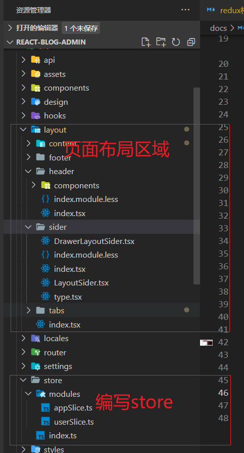

# @reduxjs/toolkit实现全局状态的管理

## 前言

最近我从`Vue-front-end`转成了`React-front-end`，在`Vue`开发的过程中使用的的状态管理库有`Vuex`和`Pinia`，都是很不错的一个库，文档很齐全，作为一个新手的我也是熟练使用的，哈哈哈，当然还是多看看文档和写demo。但是这不是今天的主人公，今天我们要讲述的是在`React`中编写全局状态集中管理，使得数据的流是有迹可循的一个工具集@reduxjs/toolkit。

都是主人公可不是`Redux`，而是`@reduxjs/toolkit`，这是官方推荐编写`Redux`逻辑的工具集，极大的简化了`Redux`配置各种**action**和**action-types**的繁琐步骤。

它包括几个实用程序功能，这些功能可以简化最常见场景下的`Redux`开发，包括配置`store`、定义`reducer`，不可变的更新逻辑、甚至可以立即创建整个状态的 “切片 slice”，而无需手动编写任何`action creator`或者`action type`。它还包括使用最广泛的`Redux`插件，例如`Redux Thunk`用于异步逻辑，而`Reselect`用于编写选择器`selector`函数，因此你可以立即使用它们。（[官网原话](https://redux-toolkit.js.org/)）

## 需要的工具集如下

- @reduxjs/toolkit：一个专门为了解决编写`Redux`繁琐的开发工具集，（[官网地址](https://redux-toolkit.js.org/)）
- react-redux：是redux官方提供给react的UI绑定层，让React组件能够从Redux中读取数据并且将数据分发到应用程序的各处。（[官网地址](https://react-redux.js.org/)）
- redux-persist：实现redux数据持久化存储的工具集。（[官网地址](https://github.com/rt2zz/redux-persist)）

## 下载相关的依赖

这里我采用的是`React18`、`vite`、`TypeScript`等搭建的项目，包管理工具使用的是`pnpm`，大家可以去其官网查看如何使用pnpm包管理的方式。（[pnpm](https://pnpm.io/)）

下载@reduxjs/toolkit依赖

```sh
pnpm add @reduxjs/toolkit
```

下载react-redux

```sh
pnpm add react-redux
```

下载redux-persist

```sh
pnpm add redux-persist
```

## 开始使用

在开始之前先看看下图这个页面的效果：


通过全局参数来设置收缩按钮的改变以及侧边栏的收缩和移动端的侧边栏弹窗适配。

话不多说，接下来就是编写实现这样的效果。不过还是先看一下我们项目的相关页面的目录结构。



### 最顶层组件mian.tsx

通过使用`react-redux`提供一个`hooks`api`Provider`实现状态数据的向下传递。

这样通过`react-redux`提供的`useSelector`api就可以拿到对应的状态值了。

```tsx
/*
 * @Author: bugdr
 * @Date: 2022-05-30 22:13:52
 * @LastEditors: bugdr
 * @LastEditTime: 2022-06-14 22:37:50
 * @FilePath: \react-blog-admin\src\main.tsx
 * @Description:
 */
import '/@/design/index.less';
import { StrictMode } from 'react';
import ReactDOM from 'react-dom/client';
import { Provider as ReduxProvider } from 'react-redux';
import { PersistGate } from 'redux-persist/lib/integration/react';
import { persister, store } from '/@/store';
import { ConfigProvider } from 'antd';

import App from './App';
import '/@/design/index.less';
import 'virtual:windi.css';

// 创建root根节点
ReactDOM.createRoot(document.getElementById('root')!).render(
  <ReduxProvider store={store}>
    <PersistGate loading={null} persistor={persister}>
      <StrictMode>
        <App />
      </StrictMode>
    </PersistGate>
  </ReduxProvider>,
);
```

### 头部组件的代码（header）

通过`useSelector`hooks函数拿到对应的状态，然后通过`useDispatch`触发`store`的状态改变，从而实现全局状态的集中管理。代码中都有相关的注释。

```tsx
/*
 * @Author: bugdr
 * @Date: 2022-05-31 10:52:26
 * @LastEditors: bugdr
 * @LastEditTime: 2022-06-23 23:34:32
 * @FilePath: \react-blog-admin\src\layout\header\index.tsx
 * @Description:头部
 */
import React, { useState } from 'react';
import { Layout } from 'antd';
import { MenuUnfoldOutlined, MenuFoldOutlined } from '@ant-design/icons';
const { Header } = Layout;
import style from './index.module.less';
import UserDropdown from './components/user-dropdown';
import HeaderBreadcrumb from './components/Breadcrumb';
import TagViews from '../tabs';
import { useDispatch, useSelector } from 'react-redux';
import {
  setCollapsed,
  setMenuDrawerVisible,
  setMenuSiderCollapsed,
} from '/@/store/modules/appSlice';

const LayoutHeader: React.FC = () => {
  // 通过useSelector拿到对应的value
  const { collapsed, isMobile, menuSiderCollapsed, menuDrawerVisible } = useSelector(
    (store: any) => store.app,
  );
  // react-redux的对应hooks,触发对应的方法
  const dispatch = useDispatch();

  const handleCollapsed = () => {
    // 通过该函数控制侧栏菜单或者侧栏弹出菜单的显示与隐藏
    // 触发对应的方法，实现全局状态的一个管理
    dispatch(setCollapsed(!collapsed));
    // 如果是移动设备并且
    if (isMobile) {
      // 如果是移动设配,弹出层可显示
      dispatch(setMenuDrawerVisible(!menuDrawerVisible));
      // 是移动设备,正常菜单就不可以收缩
      dispatch(setMenuSiderCollapsed(false));
    } else {
      // 如果不是移动设备那就可以正常收缩
      dispatch(setMenuSiderCollapsed(!menuSiderCollapsed));
      // 不是移动设备那就关闭弹出层
      dispatch(setMenuDrawerVisible(false));
    }
  };
  return (
    <>
      <Header className="mb-10 w-full bg-red-400 flex flex-col" style={{ padding: '0' }}>
        <div className="flex items-center px-2">
          <div className="flex md:w-4/5 min-w-30">
            {/* 收缩图标 */}
            {React.createElement(collapsed ? MenuUnfoldOutlined : MenuFoldOutlined, {
              className: `{style['trigger']} text-xl mr-2`,
              onClick: handleCollapsed,
            })}
            {/* 面包屑 */}
          :{...无关代码}
          </div>
        {...无关代码}
      </Header>
    </>
  );
};
export default LayoutHeader;
```

### 左侧菜单栏代码（sider）

index.tsx

```tsx
/*
 * @Author: bugdr
 * @Date: 2022-05-31 10:52:16
 * @LastEditors: bugdr
 * @LastEditTime: 2022-06-21 16:41:56
 * @FilePath: \react-blog-admin\src\layout\sider\index.tsx
 * @Description:侧边栏
 */
import React, { useEffect, useState } from 'react';
import LayoutSider from './LayoutSider';
import DrawerLayoutSider from './DrawerLayoutSider';
import { asyncRoute } from '/@/router';
import { getItem, MenuItemType } from './type';
import { useDispatch, useSelector } from 'react-redux';
import {
  setIsMobile,
  setMenuDrawerVisible,
  setMenuSiderCollapsed,
} from '/@/store/modules/appSlice';

const Sider: React.FC = () => {
  // 对菜单进行循环编译
  const initAsyncRouterList = (routeList: MenuItemType[]) => {
    return routeList.map((route) => {
      return getItem(route);
    });
  };

  // 通过查询屏幕宽度获取设备的值，创建两个组件,第一个组件是抽屉的，用于在移动端显示的
  // 判断设备,返回侧边栏应该显示哪一种
  // 通过监听屏幕宽度的变化实现，判断当前的屏幕宽度是否小于800
  const { isMobile, menuDrawerVisible, menuSiderCollapsed, collapsed } = useSelector(
    (store: any) => store.app,
  );
  const dispatch = useDispatch();
  // 屏幕可视宽度
  const getClientWidth = () => {
    const initWidth = window.document.documentElement.clientWidth;
    // 是移动设备
    // 触发设备状态变化
    dispatch(setIsMobile(initWidth <= 800 ? true : false));
    // 显示弹窗菜单
    dispatch(setMenuDrawerVisible(isMobile ? true : false));
    // 关闭正常的缩放,判断是否是移动设备
    dispatch(
      setMenuSiderCollapsed(isMobile && menuDrawerVisible ? false : collapsed ? true : false),
    );
  };

  useEffect(() => {
    getClientWidth();
    // 触发屏幕监听函数
    window.addEventListener('resize', () => {
      getClientWidth();
    });
    // 销毁
    return window.removeEventListener('resize', () => {
      getClientWidth();
    });
  }, [isMobile]);
  const Sider = () => {
    return isMobile ? (
      <DrawerLayoutSider routeMenuList={initAsyncRouterList(asyncRoute)} />
    ) : (
      <LayoutSider routeMenuList={initAsyncRouterList(asyncRoute)} />
    );
  };
  return <Sider />;
};

export default Sider;
```

LayoutSider.tsx

```tsx
/*
 * @Author: bugdr
 * @Date: 2022-05-31 12:52:31
 * @LastEditors: bugdr
 * @LastEditTime: 2022-06-21 22:20:13
 * @FilePath: \react-blog-admin\src\layout\sider\LayoutSider.tsx
 * @Description:
 */
import React, { useEffect, useState } from 'react';
import { Button, Layout, Menu } from 'antd';
import { Link, useNavigate } from 'react-router-dom';
import { MenuItemType } from './type';
import { ERROR_PAGE, PAGE_NOT_FOUND_NAME } from '/@/router/constant';
import { useSelector } from 'react-redux';
const { Sider } = Layout;

const LayoutSider: React.FC = (props: any) => {
  // 结构props的值
  const { routeMenuList } = props;
  // 路由的链接
  const routeList: MenuItemType[] | any = [];
  routeMenuList.map((item: any) => {
    if (item.label !== ERROR_PAGE) {
      routeList.push(item);
    }
  });
  // 初始化默认选中的第一个Item
  const [defaultMenuItemKeys, setDefaultMenuItemKeys] = useState<string[]>(['/dashboard']);
  // 默认选中的第一个子Item
  const [defaultSubItemKeys, setDefaultSubItemKeys] = useState<string[]>(['/dashboard/analysis']);

  // 触发useEffect
  useEffect(() => {
    // setDefaultMenuItemKeys();
  }, []);

  // 获取appSlice的值,收缩菜单栏
  const { menuSiderCollapsed } = useSelector((store: any) => store.app);
  // react-route的hooks
  const navigate = useNavigate();
  // 跳转对应的路由链接
  const onSelect = (menuList: any) => {
    const { key } = menuList;
    navigate(key);
    setDefaultMenuItemKeys(key);
  };
  // 结构菜单栏
  return (
    <Sider className="z-100 h-full" trigger={null} collapsible collapsed={menuSiderCollapsed}>
      <div className="h-8 m-4 text-light-50 text-center bg-red-400">logo</div>
      <Menu
        theme="dark"
        mode="inline"
        defaultSelectedKeys={defaultMenuItemKeys}
        defaultOpenKeys={defaultSubItemKeys}
        items={routeList}
        onSelect={onSelect}
      ></Menu>
    </Sider>
  );
};

export default LayoutSider;
```

DrawerLayoutSider.tsx

```tsx
import React, { useState } from 'react';
import { Drawer } from 'antd';
import LayoutSider from './LayoutSider';
import { useDispatch, useSelector } from 'react-redux';
import { setMenuDrawerVisible } from '/@/store/modules/appSlice';

const DrawerLayoutSider: React.FC = (props) => {
  const { routeMenuList } = props;
  // 获取弹出层菜单是否可以显示
  const { menuDrawerVisible } = useSelector((store: any) => store.app);
  // 触发更新的方法
  const dispatch = useDispatch();
  // 控制显示，点击关闭
  const handleClose = () => {
    dispatch(setMenuDrawerVisible(!menuDrawerVisible));
  };
  return (
    <Drawer
      onClose={handleClose}
      visible={menuDrawerVisible}
      bodyStyle={{ padding: '0' }}
      width={200}
      closable={false}
      placement="left"
      mask={true}
    >
      <LayoutSider routeMenuList={routeMenuList} />
    </Drawer>
  );
};

export default DrawerLayoutSider;
```

### store的构建

index.ts代码如下

```ts
/*
 * @Author: bugdr
 * @Date: 2022-05-31 10:07:55
 * @LastEditors: bugdr
 * @LastEditTime: 2022-06-19 13:52:49
 * @FilePath: \react-blog-admin\src\store\index.ts
 * @Description:创建store
 */
import { combineReducers, configureStore } from '@reduxjs/toolkit';
import {
  FLUSH,
  PAUSE,
  PERSIST,
  persistReducer,
  persistStore,
  PURGE,
  REGISTER,
  REHYDRATE,
} from 'redux-persist';
import storage from 'redux-persist/lib/storage';
import promiseMiddleware from 'redux-promise';
import appSlice from './modules/appSlice';
import userSlice from './modules/userSlice';

// 持久化配置，不再直接采用localStorage来缓存，刷新页面之后状态也不会消失
const persistConfig = {
  key: 'root',
  storage,
};

// 配置多个reducers，通过这个组合的hooks
const reducers = combineReducers({
  user: userSlice,
  app: appSlice,
});

const persistedReducer = persistReducer(persistConfig, reducers);

// 配置Store
export const store = configureStore({
  reducer: persistedReducer,
  // 中间件，实现网络请求，异步操作，中间件等
  middleware: (getDefaultMiddleware) =>
    getDefaultMiddleware({
      serializableCheck: {
        ignoredActions: [FLUSH, REHYDRATE, PAUSE, PERSIST, PURGE, REGISTER],
      },
    }).concat([promiseMiddleware]),
});

// 持久存储Store
export const persister = persistStore(store);

// 根root状态，并且导出
export type RootState = ReturnType<typeof store.getState>;
```

#### appSlice.ts

```ts
import { createSlice } from '@reduxjs/toolkit';

// 初始化app的state
const initialState = {
  isMobile: false, // 是移动设备
  collapsed: false, // 图标是否收缩
  menuDrawerVisible: false, // 菜单抽屉是否可见
  menuSiderCollapsed: false, // 菜单正常是否可收缩
};

// 创建一个appSlice
export const appSlice = createSlice({
  name: 'app',
  initialState,
  // 定义reducers对应的方法
  reducers: {
    // 定义触发收缩的方法
    setCollapsed: (state, action) => {
      state.collapsed = action.payload;
    },
    // 定义触发是否是移动设备的方法
    setIsMobile: (state, action) => {
      state.isMobile = action.payload;
    },
    // 设置菜单抽屉是否可见
    setMenuDrawerVisible: (state, action) => {
      state.menuDrawerVisible = action.payload;
    },
    // 设置菜单是否可收缩
    setMenuSiderCollapsed: (state, action) => {
      state.menuSiderCollapsed = action.payload;
    },
  },
});

// 解构导出reducers的相关方法
export const { setCollapsed, setIsMobile, setMenuDrawerVisible, setMenuSiderCollapsed } =
  appSlice.actions;

// 导出
export default appSlice.reducer;
```

通过如上的相关代码就可以完成我们侧边菜单栏的收缩和移动端适配抽屉菜单了。